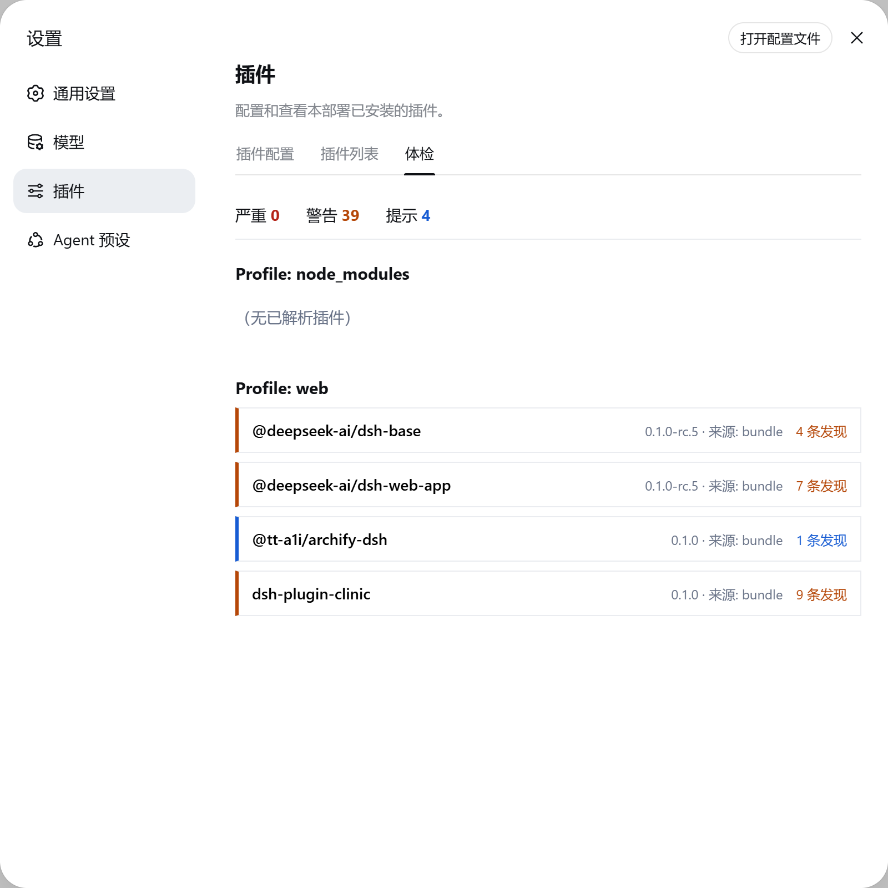
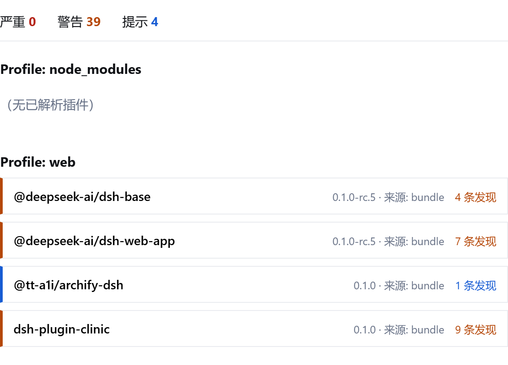

# dsh-plugin-clinic

**Plugin Clinic** — read-only health checks for the installed DeepSeek Harness plugin set.

[中文](README.zh.md) · [Usage](docs/usage.md) · [Checks](docs/checks.md)

DeepSeek Harness is "everything is a plugin", which spreads stability risk across a
freely-composable configuration layer — yet nothing tells you whether your installed set
is healthy. `dsh-plugin-clinic` closes that gap: it inspects every profile under the
Harness home and reports loader health, dependency integrity, version compatibility,
install-script risk, duplicates, and patch integrity, with no writes and no external
state.

## Features

- **Model tool `plugin_health`** — the agent can diagnose its own environment in-session
  and turn findings into concrete fix advice.
- **Web dashboard** — a "体检" (Clinic) tab in Settings → Plugins, one entry per profile
  with severity-colored plugin cards.
- **JSON reports** — a stable `schemaVersion: 1` contract for CI and scripts.
- **8 read-only checks** — see [docs/checks.md](docs/checks.md): `load-health`,
  `bundle-manifest`, `peer-deps`, `runtime-compat`, `install-scripts`, `duplicate`,
  `patch-health`, `provenance`.
- **One row install** — a single npm bundle patch mounts both the Host engine and the
  browser dashboard.

## Screenshots

The Clinic dashboard inside the official Web GUI — Settings → Plugins → 体检. Per-profile
plugin cards carry severity-colored status lines, expandable findings, and the summary bar
counts critical/warning/info findings across every profile:





## Install

```sh
# from npm (prebuilt lib/)
dsh plugin --profile web add dsh-plugin-clinic

# or straight from GitHub (sources; the prepare script builds them, pnpm asks you to
# allow the build once — see the official publish guide for the allowBuilds semantics)
dsh plugin --profile web add github:you/dsh-plugin-clinic
```

Restart the profile. The Settings → Plugins section gains a Clinic tab; the session gains
the `plugin_health` tool.

## Quick start

In any session on a profile where the plugin is installed:

```
体检一下我的插件
```

or call the tool directly with `{"details": true}` for per-finding evidence. In the Web
GUI, open Settings → Plugins → 体检 to see every profile's health at a glance.

## Configuration

Edit the bundle row in the profile's `cordis.patch.yml`:

```yaml
- id: clinic
  name: 'dsh-plugin-clinic'
  config:
    profiles: []            # profile directory names to diagnose; empty = all
    enableTool: true        # register the plugin_health tool
    enableWebRoute: true    # register /clinic HTTP routes when a webServer exists
    webRoutePrefix: '/clinic'
    includeHomePatches: true
```

## HTTP endpoints

| Endpoint | Returns |
|---|---|
| `GET /clinic/health` | full `ClinicReport` |
| `GET /clinic/health/summary` | summary projection for the dashboard |

Routes require a loopback `Host` header (DNS-rebinding defense, same spirit as the
official `/api` fence); they are not authentication.

## Architecture

One npm package, two halves. The Host half owns a pure diagnostic engine
(`src/engine/`, no I/O, no ctx), the `plugin_health` tool, and the `/clinic` routes.
The browser half registers the Clinic tab into the official `settings.plugins.tab`
extension point and fetches the same report the tool returns. Design rationale is
documented in the repository's internal working docs (not shipped with the package).

## Model Experience

### Request context and condition

#### What the model sees

One tool schema: `plugin_health` with `profiles`, `severity`, and `details` parameters.
The tool is registered on `ctx.tools` like any model-facing tool, so its schema flows
into the system-prompt assembly of every agent in a profile that loads this plugin.

#### Token effect

Fixed at registration: one tool schema entry per agent. The execution result is a
`ClinicReport` JSON document whose size scales with the number of diagnosed plugins;
`details: false` (the default) returns counts only, keeping the model-visible payload
bounded regardless of how many plugins are installed.

#### KV Cache effect

The tool schema is part of the fixed prompt prefix and does not invalidate reuse.
The execution result is a per-turn tool result, not part of any later request prefix.

## Known Limitations and Deferred Work

- **Diagnosis only, no fixes** — v1 reports; repair is agent/user action. A dry-run fix
  proposal surface is planned for a later milestone.
- **No npm online checks** — `deprecated` flags and update availability are v2 (configurable
  + cached); v1 is fully offline.
- **Current profile is not detectable** — DSH exposes no API for the running profile name,
  so v1 diagnoses every profile (config can narrow the list). `--profile` extraction from
  argv is best-effort UI highlighting only, never authoritative.
- **Browser-first dashboard** — the Clinic tab is verified against the official Web GUI;
  Electron desktop shells carry fetch over an IPC bridge and are not yet validated.
- **Loader-only plugins** — entries not in a profile manifest have no package.json, so
  peer/runtime/script checks do not apply to them; only load-health and provenance do.
- **No source-level security scan** — that is `dsh-plugin-doctor`'s job; optional
  integration of its CLI is deferred to v2.
- **Report is a point-in-time snapshot** — no cache, history, or subscription
  (intentionally; the same trade-off the official plugin inventory makes).

## Documentation

- [docs/usage.md](docs/usage.md) — install, configuration, tool and dashboard usage
- [docs/development.md](docs/development.md) — build, test, publish, contribute
- [docs/checks.md](docs/checks.md) — the 8 check rules in detail

## License

MIT — see [LICENSE](LICENSE).
